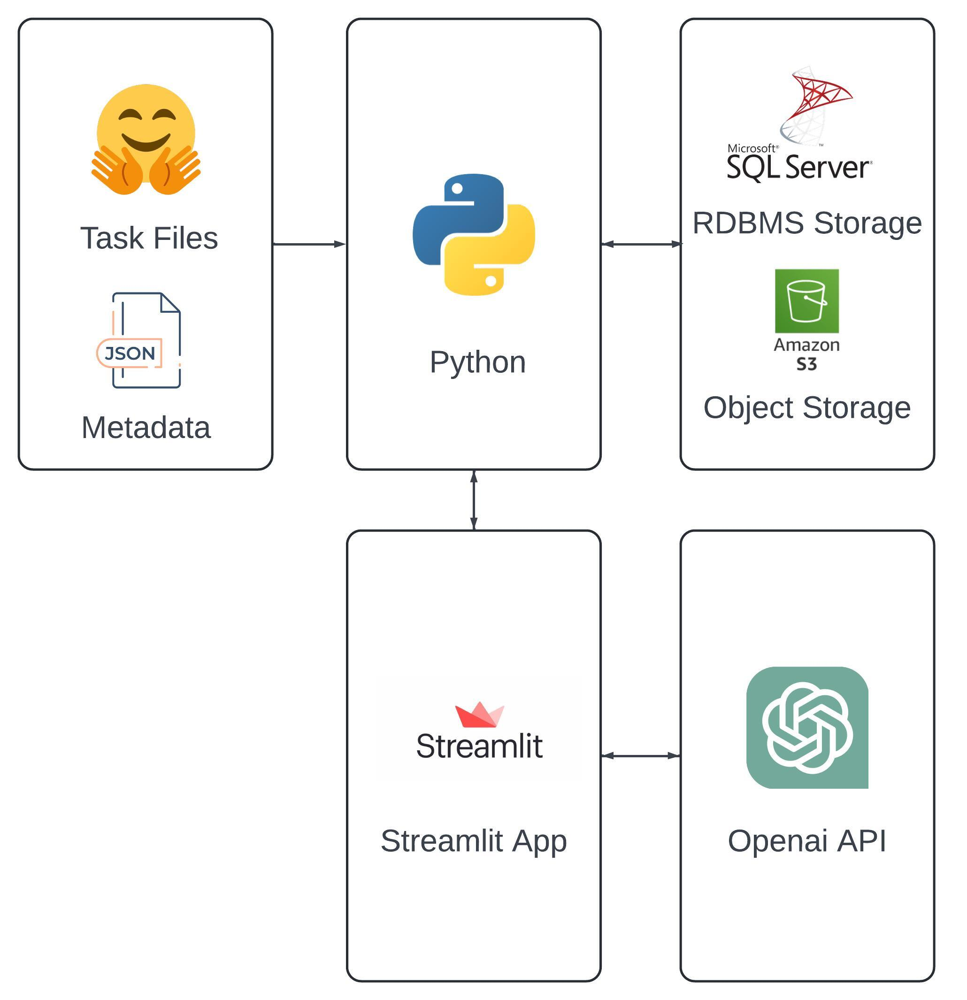

# AI-Driven DataStream Platform with Streamlit, S3 & SQL Integration

This project is a data processing and analysis pipeline that integrates various technologies including AWS S3, SQL Server, Streamlit, and OpenAI's API. It enables the storage, retrieval, and processing of both structured metadata and unstructured task files, and provides a user interface for interacting with these data sources.

## Attestation and Contribution Declaration:
WE ATTEST THAT WE HAVEN’T USED ANY OTHER STUDENTS’ WORK IN OUR
ASSIGNMENT AND ABIDE BY THE POLICIES LISTED IN THE STUDENT HANDBOOK
Contribution:
a. Chiu Meng Che: 33%
b. Shraddha Bhandarkar: 33%
c. Kefan Zhang: 33%

## WorkFlow Diagrams



## Codelabs

[Click it to view it](https://docs.google.com/document/d/1VWno-QaJeqhGaypo58udlU1Fef-GXxOGoRelIDyttXA/edit#heading=h.dcfpcyumt53x
) 
## Video 

[Click it to watch it](https://youtu.be/pWp70t16a5o)

## Link to streamlit public cloud

[Click it to access streamlit public cloud](https://cwmip3dugo4l2udm3gfs3l.streamlit.app/) 

## Overview

The project architecture consists of:

- **Python Modules**: Handle the interaction with RDBMS storage, object storage, metadata processing, and integration with the OpenAI API.
- **Object Storage**: Uses Amazon S3 for storing unstructured task files.
- **RDBMS Storage**: Uses Microsoft SQL Server to store structured metadata.
- **Streamlit App**: A user interface for uploading files, processing data, and viewing results.
- **OpenAI API**: Utilizes OpenAI's capabilities to analyze the unstructured data.

## Features

- **Upload Data to S3**: Upload task files to Amazon S3.
- **Upload Metadata to SQL Server**: Store metadata information in an SQL Server database.
- **Data Matching**: Match metadata with corresponding task IDs stored in S3.
- **Integration with OpenAI**: Send data to OpenAI for analysis and display results in the Streamlit app.
- **Streamlit Interface**: Interactive app for managing data uploads, processing, and analysis.

## Prerequisites

- Python 3.8+
- [Poetry](https://python-poetry.org/) for package management
- AWS credentials configured for access to S3
- Microsoft SQL Server instance
- OpenAI API key
- Streamlit installed (`pip install streamlit`)

## Installation

1. **Clone the repository:**
   ```bash
   git clone https://github.com/yourusername/your-repo-name.git
   cd your-repo-name
2. **Set up the Python environment:**
   ```bash
   poetry install
4. **Configure Environment Variables:**
   ```makefile
   AWS_ACCESS_KEY_ID=your_aws_access_key
   AWS_SECRET_ACCESS_KEY=your_aws_secret_key
   SQL_SERVER_CONNECTION_STRING=your_sql_server_connection_string
   OPENAI_API_KEY=your_openai_api_key
5. **Run the Streamlit App:**
   ```bash
   streamlit run streamlit_app.py

## File Structure

- aws_module.py: Contains functions to interact with AWS S3.
- sql_module.py: Handles interactions with the SQL Server for metadata storage.
- openai_module.py: Interfaces with the OpenAI API for data processing.
- streamlit_app.py: Main file to launch the Streamlit application.
- upload_data_to_s3.py: Script for uploading files to AWS S3.
- upload_metadata_rdb.py: Script for uploading metadata to the SQL Server.

## Usage

- Upload Data: Use the Streamlit app to upload task files and metadata.
- Data Processing: The backend Python modules handle the data processing and storage.
- Analyze with OpenAI: Send data to the OpenAI API for analysis and view results in the Streamlit app.
- Data Matching: Match metadata in SQL Server with task files in S3 for further processing.

## Contributions and Time

Chiu Meng Che:
1. Use Beautiful Soup to directly import files from Hugging Face into AWS S3 using Python (6-8 hours).
2. Convert the metadata into JSON format and use Python to import it into SQL Server (3-4 hours).
3. Use the Streamlit package in Python to combine the metadata and data, and display them on Streamlit (24-28 hours).
4. Assist team members with the creation of the annotator part and visualizations (24-28 hours).
5. Create a workflow graph (1 hour).
6. Create a README file (2 hours).

Shraddha Bhandarkar: 
1. Fetch and Process Prompts from Metadata: Implemented functionality to extract prompts from metadata and route them to the OpenAI API for processing (6-8 hours). 
2. File Handling Based on Extension: Developed a system to detect and process files associated with prompts based on their extensions. Supported file types included `.png`, `.jpeg`, `.jpg`, `.txt`, `.xlsx`, `.csv`, `.pptx`, `.docx`, `.py`, `.zip`, and `.pdb`, with         specific handling logic for each (24-48 hours). 
3. Project Setup with Poetry: Configured the project using Poetry for efficient dependency management and environment setup, ensuring consistency across development and deployment environments (3-4 hours).
4. Team Support: Assisted team members with integrating file handling functionalities and setting up the project environment (2-3 hours). 
5. Documentation: Created detailed documentation, including a README file, outlining the file handling mechanism and project setup instructions (2 hours). 
6. Workflow Design: Developed a workflow diagram illustrating the prompt processing and file handling architecture (1 hour).

Kefan Zhang:
1. Set up and configured a SQL Server instance within a Docker container on macOS, ensuring correct port configuration and testing database connectivity. This allowed for seamless data storage and interaction between the backend and the database.（5h)
2. Developed Python test scripts to execute SQL queries for data retrieval and updates. The scripts were designed to efficiently handle data transactions between the application and SQL Server, ensuring smooth data processing and accuracy.(1h)
3. Enabled dynamic updates to AnnotatorSteps, allowing users to modify steps in real-time through an interactive interface. Upon modification, the system automatically triggered a model re-evaluation based on the newly provided annotation steps. This continuous            feedback loop ensured that the model was iteratively improved and fine-tuned based on the evolving requirements of the data annotation process.(>29h)
4. Integrated visualization tools in Streamlit to enhance user experience. This included real-time feedback visualization, allowing users to see how their annotations and modifications impacted model performance. (>15h)
5. Created Codelabs to guide users through the process of modifying annotator steps, understanding the underlying model, and evaluating the model’s performance based on their updates.(5h)
